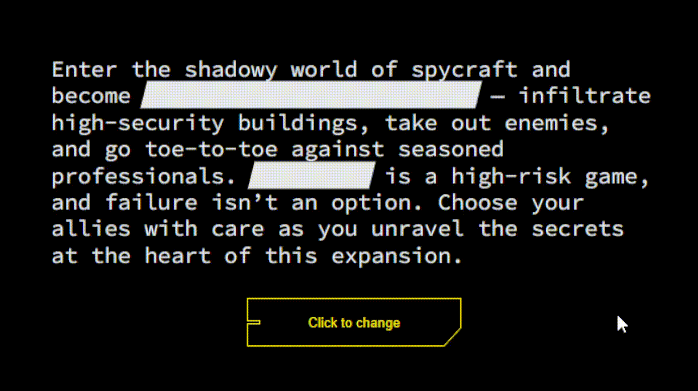

# Reveal Text - Cyberpunk Style
In this code I was able to learn how to reveal a text with JavaScript when clicking on a button.

You could see this project alive in my Pen.

Check it out :arrow_heading_down:

[Reveal Text - Cyberpunk style](https://codepen.io/alexvmldev/pen/NWJKxgG) :link:

<a href="https://codepen.io/alexvmldev" target="blank">@alexvmldev</a>
